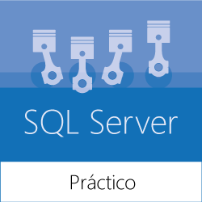
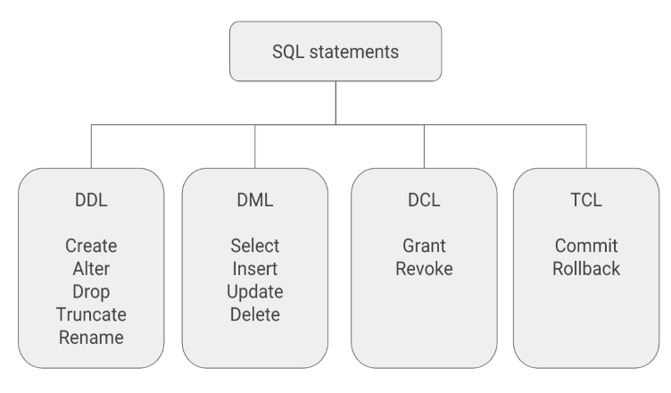
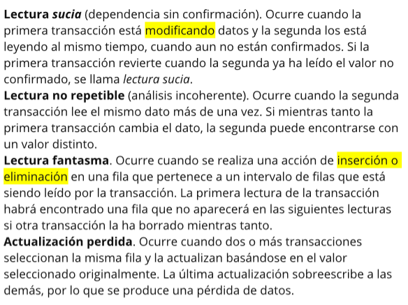
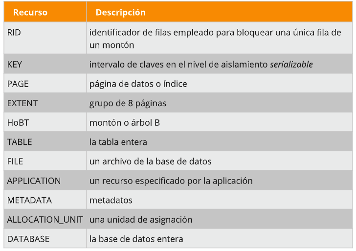
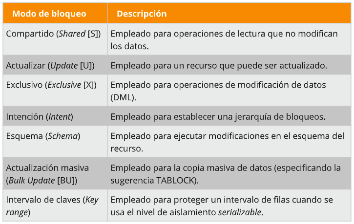
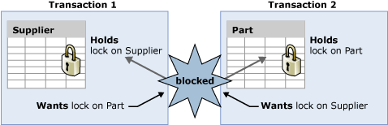

<div align="center"></div>

# SQL Server práctico para desarrolladores (Introbook)

## Tabla de contenido

- [MODULO 1: Trabajando con objetos de bases de datos](#modulo-1-trabajando-con-objetos-de-bases-de-datos)
    - [Comprendiendo las tablas](#comprendiendo-las-tablas)
    - [Tipos de datos en SQL Server](#tipos-de-datos-en-sql-server)
    - [Opciones de tablas y columnas](#ppciones-de-tablas-y-columnas)
    - [Restricciones](#restricciones)
    - [Vistas](#vistas)
    - [Sinónimos](#sinónimos)
    - [Triggers](#triggers)
- [MODULO 2: T-SQL y programabilidad de bases de datos](#modulo-2-t-sql-y-programabilidad-de-bases-de-datos)
    - [Introducción a SQL](#introducción-a-sql)
    - [Instrucciones DDL y DML](#instrucciones-ddl-dml)
    - [Consultas y subconsultas](#consultas-y-subconsultas)
    - [Extendiendo conjunto de resultados](#extendiendo-conjunto-de-resultados)
    - [Objetos temporales](#objetos-temporales)
    - [Programabilidad con T-SQL](#programabilidad-con-t-sql)
    - [Qué es un procedimiento almacenado](#que-es-un-procedimiento-almacenado)
    - [Funciones personalizadas](#funciones-personalizadas)
- [MODULO 3: Trabajando con índices](#modulo-3-trabajando-con-índices)
    - [Acerca de los índices](#acerca-de-los-índices)
    - [Tipos de índices](#tipos-de-índices)
- [MODULO 4: Trabajando con transacciones](#modulo-4-trabajando-con-transacciones)
    - [Qué es una transacción](#qué-es-una-transacción)
    - [Tipos de transacciones](#tipos-de-transacciones)
    - [Niveles de aislamiento](#niveles-de-aislamiento)
    - [Bloqueos](#bloqueos)
    - [Interbloqueos](#interbloqueos)

- [SQL Server Interview Questions] 
https://www.c-sharpcorner.com/article/most-asked-sql-queries-in-interview-questions/
https://www.c-sharpcorner.com/UploadFile/puranindia/sql-server-interview-questions/
TOP 30 SQL Interview Coding Tasks (book)


## MODULO 1: Trabajando con objetos de bases de datos

### Comprendiendo las tablas

* Las tablas son los objetos básicos de un sistema de gestión de bases de datos porque son las que contienen todos los datos que tenemos que almacenar.
* Tenemos que diseñarlas empleando las mejores prácticas y estruturarlas de la mejor manera posible para que puedan almacenar grandes cantidades de datos.
* De forma lógica, las tablas se organizan en esquemas (schemas). Si no especificamos ningún esquema, econtraremos las tablas dentro del esquema por defecto (normalmente es dbo, aunque depende de la configuración).
* Los esquemas nos ayudan a organizar mejor el diseño del modelo y a mejorar la gestión de la seguridad. 

[](https://www.youtube.com/watch?v=muy6IsnE8Do)

```sql
-- crear login
use master
go
create login UserInformatica with password = 'NOfumar34*'

-- crear un user para el login
use Northwind
create user UserInformatica for login UserInformatica
with default_schema = Informatica
go

-- crear esquema asociado al user
use Northwind
go
create schema Curso authorization UserInformatica
go

create schema Informatica authorization UserInformatica
go

-- dar permisos de creación de tabla al usuario
grant create table to UserInformatica
go
```


```
Es mejor indicar el esquema siempre, incluso aunque sea el esquema por defecto.
```


### Tipos de datos en SQL Server

### Opciones de tablas y columnas

### Restricciones

### Vistas

### Sinónimos

### Triggers

[](https://www.youtube.com/watch?v=auHLx6XJbN8&t=1082)

Los Triggers son similarres a los store procedures, con la diferencia de que no pueden ser llamados directamente, pues están vinculado a una tabla y responden de acuerdo a una acción que se ejecuta sobre la tabla (insert, update o delete)

Tipos de Triggers
* AFTER… DML Trigger: ocurren después que se inserta, actualiza o eliminar un elemento dentro de la tabla
* INSTEAD OF… DML Trigger: cancela la acción desencadenadora y rehace una nueva acción que nosotros designemos.

Escenarios para usar Triggers
* Validar datos antes de ser insertados. Similar a la restricción CHECK
	* Debemos preferir las restricciones antes que los Triggers, puesto estos son más costosos.
	* El Trigger es reactivo, es decir, el dato se inserta/modifica/eliminar y luego reacciona el Trigger. El constraint es proactivo
	* Con los Triggers podemos validar condiciones más complejas
* Actualizar inventarios


Cuando se elimina un dato se tiene un tabla temporal que tiene el o los datos eliminados y se llama Deleted

Cuando se inserta un dato se tiene un tabla temporal que tiene el o los datos insertados y se llama Inserted

Cuando se actualiza un dato se tiene dos tablas que tiene el o los datos modificados, las tablas son deleted e inserted

Un Trigger puede modificar una tabla  que tenga un Trigger.. lo cual puede generar una cadena de Triggers. Hay que evitar los ciclos! 


```sql
use Northwind

create table HistorialEliminaciones
(
codigo int identity(1,1) primary key,
fecha date, 
accion varchar(200),
usuario varchar(150)
)
go

create trigger Tr_insert_cliente on customers for delete 
as
begin 
	insert into HistorialEliminaciones(fecha, accion, usuario) values
	(getdate(), 'se ha eliminado un dato', USER)
end 

--consultar los triggers sobre una tabla
sp_helptrigger customers
go


--Quitar de inventario con un trigger
create trigger Tr_quitarstock on [order details] for insert
as
begin
	update Products 
	set Products.UnitsInStock = Products.UnitsInStock - inserted.Quantity from inserted inner join Products on inserted.ProductID = Products.ProductID
end

--verificar unidades en stock de producto 34
select * from Products where ProductID = 34

--insertar a order details
insert into [Order Details] (OrderID, ProductID, UnitPrice, Quantity, Discount)
values (10248, 34, 14, 100, 0)
go

--Regregar a inventario con un trigger
create trigger Tr_devolverstock on [order details] for delete
as
begin
	update Products 
	set Products.UnitsInStock = Products.UnitsInStock + deleted.Quantity from deleted inner join Products on deleted.ProductID = Products.ProductID
end
go


--Trigger que actualiza las unidades en stock
create trigger Tr_actualizastock on [order details] for update 
as 
begin 
	update Products 
	set Products.UnitsInStock = Products.UnitsInStock + deleted.Quantity from deleted inner join Products on deleted.ProductID = Products.ProductID

	update Products 
	set Products.UnitsInStock = Products.UnitsInStock - inserted.Quantity from inserted inner join Products on inserted.ProductID = Products.ProductID
end


--eliminar el dato
delete from [Order Details]
where OrderId=10248 and ProductId = 34
go

--modicar el dato pedido
update [Order Details]
set Quantity = 50
where orderid=10248 and productid=34
go
--Triggers instead of

create view catalogo_clientes_proveedores
as
select companyname, contactname, country, 'customers' as states from customers
union all
select companyname, contactname, country, 'suppliers' as states from Suppliers
go


create trigger Tr_catalogo_clientes_proveedores on catalogo_clientes_proveedores instead of insert
as
begin
	insert into Suppliers (CompanyName, ContactName, Country)
	select CompanyName, ContactName, Country from inserted where states = 'suppliers'

	insert into customers(CustomerID, CompanyName, ContactName, Country)
	select SUBSTRING(companyname, 1, 5) as codigo, companyname, contactname, country from inserted where states = 'customers'

end
go

Insert into catalogo_clientes_proveedores (CompanyName, ContactName, Country, states)
values ('Empresa X', 'Juan Perez', 'Nicaragua', 'supliers'),
	   ('AntiguaExpress', 'Juan Perez', 'Costa Rica', 'customers'),
	   ('America', 'Juan Perez', 'Panama', 'customers')
go

```


## MODULO 2: T-SQL y programabilidad de bases de datos

### Introducción a SQL

SQL es el lenguaje básico de todos los RDBMS. La operación más común en SQL es la instrucción `SELECT`.

Las consultas tienen la siguiente estructura:
* cláusula `FROM` para indicar el objeto de destino de la consulta;
* puede incluir un `JOIN` que vincule tablas;
* cláusula `WHERE` para las expresiones de filtro (predicados);
* cláusula `GROUP BY` para agrupar datos (usada especialmente en combinación con funciones de agregado);
* cláusula `HAVING` para filtrar las filas devueltas por la cláusula GROUP BY;
* cláusula `ORDER BY` para indicar las columnas según las que hay que ordenar los resultados.

HAVING
* HAVING filters records that work on summarized GROUP BY results.
* HAVING applies to summarized group records, whereas WHERE applies to individual records.
* Only the groups that meet the HAVING criteria will be returned.
* HAVING requires that a GROUP BY clause is present.
* WHERE and HAVING can be in the same query.

https://www.dofactory.com/sql/having


Links
1.Consultas SQL- Transact-SQL (Select, Where, group by, having, order by, join)
https://www.youtube.com/watch?v=IkWjLBIolso&t=1213s


<div align="right"><small><a href="#tabla-de-contenido">volver al inicio</a></small></div>

### Instrucciones DDL y DML



* DDL (Data Definition Language): Permite crear y modificar la estructura de una base de datos.
    * CREATE: Utilizado para crear nuevas tablas, campos e índices.
    * ALTER: Utilizado para modificar las tablas agregando campos o cambiando la definición de los campos.
    * DROP: Empleado para eliminar tablas e índices.
    * TRUNCATE: Empleado para eliminar todos los registros de una tabla.
    * COMMENT: Utilizado para agregar comentarios al diccionario de datos.
    * RENAME: Tal como su nombre lo indica es utilizado para renombrar objetos.
* DML (Data Manipulation Language): Permite recuperar, almacenar, modificar, eliminar, insertar y actualizar datos de una base de datos.
    * SELECT: Utilizado para consultar registros de la base de datos que satisfagan un criterio determinado.
    * INSERT: Utilizado para cargar de datos en la base de datos en una única operación.
    * UPDATE: Utilizado para modificar los valores de los campos y registros especificados
    * DELETE: Utilizado para eliminar registros de una tabla de una base de datos.
* DCL (Data Control Language): Permite crear roles, permisos e integridad referencial, así como el control al acceso a la base de datos.
    * GRANT: Usado para otorgar privilegios de acceso de usuario a la base de datos.
    * REVOKE: Utilizado para retirar privilegios de acceso otorgados con el comando GRANT.
* TCL (Transactional Control Language): Permite administrar diferentes transacciones que ocurren dentro de una base de datos.
    * COMMIT: Empleado para guardar el trabajo hecho.
    * ROLLBACK: Utilizado para deshacer la modificación que hice desde el último COMMIT.

<div align="right"><small><a href="#tabla-de-contenido">volver al inicio</a></small></div>

### Consultas y subconsultas

#### ¿Qué es una consulta?

A query is a question or inquiry to a set of data. We use SQL, or Structured Query Language, to retrieve data from databases.

¿Cómo funciona una consulta?

La lógica que sigue el motor para el procesado de consultas es la siguiente:


Cada paso genera una **tabla virtual** que se usa para el paso siguiente.

#### ¿Qué es una subconsulta?

Es una consulta anidada que es parte de otra instrucción SELECT, INSERT, UPDATE, DELETE o bien otra subconsulta.
```sql
SELECT
    T.CustomerID,
    T.MaxTotalQuantity
FROM 
    (
        SELECT
            CustomerID,
            MaxTotalQuantity = MAX(TotalQuantity)
        FROM Sales.SalesOrders
        WHERE TotalQuantity > 0
        GROUP BY CustomerID
    ) AS T
WHERE T.CustomerID = 10
```


[](https://www.youtube.com/watch?v=QucZ1itSzVw)


```sql
--SUBCONSULTAS AUTONOMAS

select T.CompanyName, sum(T.Total) as Total from 
(
select c.CompanyName, o.OrderID, o.OrderDate, p.ProductName, d.UnitPrice, d.Quantity, d.UnitPrice * d.Quantity as Total
from Customers as c
inner join Orders as o on c.CustomerID = o.CustomerID
inner join [Order Details] as d on d.OrderID = o.OrderID
inner join Products as p on p.ProductID = d.ProductID
) as T group by T.CompanyName

--subquery devuelto como un escalar calculando fila por fila
select 
	ProductName, 
	UnitPrice, 
	(select avg(unitprice) from Products) as Average,
	(select avg(unitprice) from Products) - UnitPrice as Varianza
from Products

-- devuelve los datos de los cliente que tienen ordenes
select c.companyname, c.country, c.contactname
from Customers as c 
where c.CustomerID in (select distinct customerid from Orders)


--SUBCONSULTAS CORRELACIONADAS

--devuelve todas las ordenes donde se pidieron mas de 20 unidades del producto 23

select o.customerid, o.orderid, o.orderdate from orders as o
where
(
select d.quantity from [Order Details] as d
where d.ProductID = 23 and o.OrderID = d.OrderID
) > 20

-- subquery con resultado de multiples valores
-- devuelve los datos de los cliente que tienen ordenes
select c.companyname, c.country, c.contactname
from Customers as c where exists
(
select o.customerid from Orders as o 
where c.CustomerID = o.CustomerID
)
GO

```
Lugares donde se pueden usar subconsultas

En un filtro IN
```sql
SELECT 
    SalesOrderID,
    SalesOrderDate,
    TotalQuantity,
    ExpiredDate,
    CustomerID
FROM
    Sales.SalesOrders SO
WHERE
    CustomerID IN (SELECT CustomerID FROM Sales.Customers C WHERE CustomerID > 1);
```

En instrucciones UPDATE, INSERT y DELETE
```sql
```

En filtros con operadores de comparación (mayor que, menor que, igual, etc.)
```sql
SELECT 
    SalesOrderID,
    SalesOrderDate,
    TotalQuantity,
    ExpiredDate,
    CustomerID
FROM
    Sales.SalesOrders SO
WHERE 
    TotalQuantity > (SELECT MAX(TotalQuantity) FROM Sales.SalesOrders);
```

Con la función NOT EXISTS | EXISTS
```sql
SELECT 
    SalesOrderID,
    SalesOrderDate,
    TotalQuantity,
    ExpiredDate,
    CustomerID
FROM
    Sales.SalesOrders SO
WHERE 
    NOT EXISTS (SELECT CustomerID FROM Sales.Customers C WHERE FirstName LIKE 'A%');
```

En lugar de una expresión (por ejemplo, en una instrucción SELECT)
```sql
SELECT 
    SalesOrderID,
    TotalQuantity,
    ExpiredDate,
    CustomerID,
    Days = (SELECT DATEDIFF(DAY, GETDATE(), ExpiredDate)) FROM Sales.SalesOrders WHERE SalesOrderID = 2)
FROM 
    Sales.SalesOrders SO
```


Rendimiento en subconsultas

Como cada FROM+JOIN crea un producto cartesiano entre tablas, el uso de subconsultas es una buena práctica para mejorar el rendimiento de la ejecución.

```
Caso práctico
Tenemos:
    tabla maestra --> Sales.SalesOrders
    tabla de detalles --> Sales.SalesOrderDetails

Se pide:
leer un cierto número de pedidos con sus detalles para un intervalo de tiempo

Soluciones:
    una instrucciòn SELECT con un JOIN para enlazar las tablas utilizando la columna SalesOrderId

    uso de subconsultas para filtrar registros maestros antes de unirlos con las otras tablas de detalle
```

#### Common Table Expressions (CTE)

https://www.youtube.com/watch?v=79pM5FwuW4U&t=1351s

* Ventajas
    * modularidad
    * facilidad de mantenimiento
    * pueden definirse en rutinas
* Acerca de la sintaxis
    * Se debe usar la palabra clave WITH para declarar la CTE
    * Un WITH no puede tener otra definición WITH anidada


Links:
* https://www.campusmvp.es/recursos/post/SQL-Server-Expresiones-de-tabla-comunes.aspx
* Sub-consulta en el SQL Server: https://www.youtube.com/watch?v=QucZ1itSzVw


Ejemplo de una CTE NO recursiva

```sql
WITH CustomersCTE (CustomerName, Quantity, ID)
AS
(
    SELECT DISTINCT
        C.FirstName + ' ' + C.LastName,
        SO.TotalQuantity,
        C.CustomerID
    FROM
        Sales.Customers C
    JOIN 
        Sales.SalesOrders SO ON C.CustomerID = SO.CustomerID
)

SELECT 
    CustomerName,
    Quantity,
    ID
FROM
    CustomersCTE
```

Ejemplo de CTE recursiva

* Útil para navegar a través de jerarquías 
* Nivel máximo de recursiones: 32767

Ejemplo: mostrar un jefe y sus subordinados

```sql
WITH CTE_Employees AS
(
    SELECT 
        EmployeeID, 
        ManagerID, 
        FirstName, 
        LastName, 
        1 as Pos
    FROM HR.Employees 
    WHERE EmployeeID = 10

    UNION ALL

    SELECT 
        E.EmployeeID, 
        E.ManagerID, 
        E.FirstName, 
        E.LastName, 
        (C.Pos + 1) as Pos
    FROM HR.Employees E
    INNER JOIN CTE_Employees C ON E.ManagerID = C.EmployeeID
)

SELECT * FROM CTE_Employees
```
<div align="right"><small><a href="#tabla-de-contenido">volver al inicio</a></small></div>

### Extendiendo conjunto de resultados

Hay muchas maneras de extender resultados:

* Añadir columnas calculadas
* Relacionar tablas: operadores JOIN o APPLY
* Añadir filas: operador UNION 

#### Añadir columnas calculadas

Las columnas calculadas constituyen el resultado de una expresión. Las columnas calculadas se pueden usar en:
* la lista de SELECT
* cláusula WHERE
* cláusula ORDER BY

Ejemplo que muestra como añadir una expresión a la lista de SELECT para extender el conjunto de columnas:

```sql
SELECT 
    SOD.SalesOrderID,
    SOD.OrderNumber,
    SOD.Quantity,
    SOD.Price,
    ItemTotalPrice = SOD.Quantity * SOD.Price
FROM
    Sales.SalesOrderDetails SOD
```

> **Performance tip:** Normalmente, una columna calculada es un campo virtual que no persiste en la base de datos. Sin embargo, una razón para persistir una **columna calculada** es si tenemos que aplicarle un filtro (WHERE), también con el fin de permitir al diseñador crear un índice para acelerar las búsquedas.

Formas de extender el cojunto de columnas:
* Columnas calculadas condicionales
    * Podemos añadir una columna calculada que use una condición, para lo cual empleamos la palabra clave CASE.
    * La instrucción CASE también es útil cuando queremos gestionar los valores NULL.
        * https://www.sqlservertutorial.net/sql-server-system-functions/sql-server-isnull-function/
        * https://codingsight.com/dealing-with-nulls-in-sql-server/

```sql
SELECT 
	OrderID, 
	Quantity,
	CASE WHEN Quantity > 30 THEN 'The quantity is greater than 30'
		WHEN Quantity = 30 THEN 'The quantity is 30'
		ELSE 'The quantity is under 30'
	END AS QuantityText
FROM [Order Details];
```

```sql
SELECT 
	CompanyName, 
	City, 
	Country
FROM Customers
ORDER BY
		(CASE
			WHEN City IS NULL THEN Country
			ELSE City
		END); 
```

```sql 
--gestión de valores NULL
SELECT ISNULL(NULL,20) result;
SELECT COALESCE (NULL,'GREEN','HOPE','') AS NULLRESPONSE;
```

```sql
SELECT 
	FIRSTNAME
	,LASTNAME
	,ADDRESS
	,FIRSTTRANDATE
	,PHONENUMBER1 AS [PRIMARY PHONE NUMBER]
	,ISNULL(CAST(PHONENUMBER2 AS VARCHAR), 'NO SECONDARY PHONE') AS [SECONDARY PHONE NUMBER]
FROM CUSTOMER 
WHERE PHONENUMBER2 IS NULL ;
```

```sql
SELECT 
	FIRSTNAME
	,LASTNAME
	,ADDRESS
	,FIRSTTRANDATE
	,PHONENUMBER1 AS [PRIMARY PHONE NUMBER]
	,COALESCE(CAST(PHONENUMBER2 AS VARCHAR),CAST(PHONENUMBER3 AS VARCHAR), 'NO OTHER PHONE') AS [OTHER PHONE NUMBER]
FROM CUSTOMER;
```


* Usando funciones de categoría: funciones útiles para enumerar registros, pero también para examinar la calidad de datos.
    * RANK()
    * ROW_NUMBER()
        * http://bit.ly/2TkxfRP
    * DENSE_RANK()
    * NTILE(n)
* usando funciones analíticas
    * CUME_DIST()
    * LAG()
    * LEAD()
    * PERCENTILE_CONT()
    * PERCENTILE_DISC()
    * PERCENTILE_RANK()
    * FIRST_VALUE()
    * LAST_VALUE()

Identificar los registros dobles
```sql
SELECT 
	IDMultiValue, 
	SampleValue, 
	SampleDescription,
	repeat_number = ROW_NUMBER() OVER (PARTITION BY IDMultiValue ORDER BY IDMultiValue)
FROM dbo.MultiValues
```

Cómo usar una CTE para eliminar registros duplicados
```sql
--recopila los valores repetidos
WITH MultiCTE AS
(
	SELECT 
		IDMultiValue,
		SampleValue,
		SampleDescription,
		repeat_number = ROW_NUMBER() OVER (PARTITION BY IDMultiValue ORDER BY IDMultiValue)
	FROM 
		dbo.MultiValues
)

--borrar la instrucción con la CTE
DELETE FROM MultiCTE WHERE repeat_number > 1
```

> **Nota:** Una expresión es determinista si esta devuelve siempre el mismo resultado para un conjunto de entrada. La función GETDATE() no es determinista.

#### Relacionar tablas: operadores JOIN o APPLY

* El operador JOIN nos permite hacer combinaciones lógicas entre tablas
* Podemos hacer la operación JOIN con más de 2 tablas
* Normalmente, las relaciones se establecen entre la clave principal de una tabla y la clave externa correspondiente
* Each join type specifies how SQL Server uses data from one table to select rows in another table.
* Tipos de JOIN
    * INNER JOIN
        * También se puede usar la palabra JOIN
    * OUTER JOIN
        * LEFT OUTER JOIN = LEFT JOIN
        * RIGHT OUTER JOIN = RIGTH JOIN
        * FULL OUTER JOIN = FULL JOIN
    * CROSS JOIN
        * Productos cartesianos
        * No necesita ninguna cláusula ON ya que no hay ninguna clave de coincidencia
* Operador APPLY
    * to perform join operations between a physical table and table valued function
    * permite invocar por cada fila de una consulta una **función que devuelva un tipo tabla**. En otras palabras, hace una proyección de la expresión izquierda a través de la función (o expresión de tipo tabla) que se le indica.
    * Tipos
        * CROSS APPLY: parecido a INNER JOIN
        * OUTER APPLY: parecido a LEFT JOIN
    * https://www.sqlshack.com/the-difference-between-cross-apply-and-outer-apply-in-sql-server/

```sql
-- Crear tabla A (tabla Izquierda)
CREATE TABLE A
(
a INT
);

-- Crear tabla B (tabla derecha)
CREATE TABLE B
(
b INT
);

-- Insertar datos
Insert into A (a) Values (1);
Insert into A (a) Values (2);
Insert into A (a) Values (3);
Insert into A (a) Values (4);
Insert into B (b) Values (3);
Insert into B (b) Values (4);
Insert into B (b) Values (5);
Insert into B (b) Values (6);
GO

-- Tabla A
SELECT * FROM A;

-- Tabla B
SELECT * FROM B;

/* Inner Join. */
-- Unión interna, filas que ambas tablas tienen en común.
select * from A INNER JOIN B on A.a = B.b;

/* Left outer join */
-- Unión externa por la izquierda, todas las filas de A (tabla izquierda) relacionadas con B, así estas tengan o no coincidencias.
select * from A LEFT OUTER JOIN B on A.a = B.b;

/* Right outer join */
-- Unión externa por la derecha, todas las filas de B (tabla derecha), así estas tengan o no coincidencias con A.
select * from A RIGHT OUTER JOIN B on A.a = B.b;

/* Full outer join */
-- Unión externa completa, unión externa por la izquierda unida a unión externa por la derecha. 
select * from A FULL OUTER JOIN B on A.a = B.b;

/* Cross join*/
select * from A CROSS JOIN B
```

Links:
* https://www.sqlservertutorial.net/sql-server-basics/sql-server-joins/


#### Añadir filas: operador UNION 

* El número de columnas no cambia
* Reglas para usar el operador UNION
    * El número y orden de las columnas de todas las consultas deben ser el mismo
    * Los tipos de dato de cada columna deben ser compatibles con los del conjunto de datos añadido
* Es posible que haya duplicados en las filas
    * UNION --> elimina duplicados
    * UNION ALL --> para mantener filas repetidas
* Se puede usar ORDER BY al final de los conjuntos de datos combinados

```sql
USE tempdb;
GO
-- primer conjunto
CREATE TABLE #FirstSet (id int, val varchar(10));

-- segundo conjunto
CREATE TABLE #SecondSet (id int, val varchar(10), number smallint);

-- tercer conjunto
CREATE TABLE #ThirdSet (id int, number smallint);

-- INSERT VALUES
-- ///////////////////////////////////////////
INSERT INTO #FirstSet ( id, val )
VALUES
( 1, 'ONE')
, ( 2, 'TWO')
, ( 3, 'THREE');

INSERT INTO #SecondSet ( id, val, number )
VALUES
( 3, 'THREE', 300 )
, ( 4, 'FOUR', 400 )
, ( 5, 'FIVE', 500 );

INSERT INTO #ThirdSet ( id, number )
VALUES
( 2, 200 )
, ( 3, 300 )
, ( 4, 500 );
-- ///////////////////////////////////////////

-- solo UNION (sin duplicados)
SELECT id, val FROM #FirstSet

UNION

SELECT id, val FROM #SecondSet

UNION

SELECT id, val = CASE
					WHEN id = 2 THEN 'TWO'
					WHEN id = 3 THEN 'THREE'
					WHEN id = 4 THEN 'FOUR'
				END
FROM #ThirdSet;

DROP TABLE #FirstSet;
DROP TABLE #SecondSet;
DROP TABLE #ThirdSet;
GO
```

<div align="right"><small><a href="#tabla-de-contenido">volver al inicio</a></small></div>

### Objetos temporales

* Base de datos para objetos temporales: tempdb
* Se recomienda que tempdb sea una BD separada físicamente en RAID
*  Creación de objetos temporales
    * '#' --> tabla temporal local
    * '@' --> variable de tabla

Tablas temporales locales

* visibles para su creador durante una misma conexión
* Se borran automáticamente una vez que el creador se desconecta de la instancia

```sql
USE tempdb;
GO

CREATE TABLE #FirstSet (id int, val varchar(10));
GO

DROP TABLE #FirstSet;
GO
```

Tablas temporales globales

* Visible para cualquier usuario
* Se borrarn cuando todos los usuarios que están referenciándola se desconectan de la instancia
* Ojo con el DROP TABLE porque estas tablas son de ámbito global (evitar usarlas)

```sql
USE tempdb;
GO

CREATE TABLE ##FirstSet (id int, val varchar(10));
GO    
```

Variables de tabla
* Cuando hay poca memoria libre se almacenan en tempdb, sino en memoria
* Podemos:
    * En SP: pasarle datos en forma de variable de tabla
    * En funciones: devolver variable tabla

```sql
DECLARE <table_name> TABLE (<column_definition>);
```

Ventajas/desventajas de usar tablas temporales

* Ventajas
    * la división de los datos paso a paso para mejorar las consultas grandes (optimización)
    * los objetos se autodestruyen
    * ...

* Desventajas
    * se crea una tabla temporal local para cada usuario
    * pueden crear un cuello de botella en la entrada y salida dentro tempdb


Ejemplo de como dividir una consulta en varias tablas. Vamos a intentar minizar los productos cartesianos

```sql
--consulta original
select 
	H.DueDate,
	H.Comment,
	A.AddressLine1,
	A.AddressLine2,
	A.City,
	PR.FirstName,
	PR.LastName,
	D.UnitPrice,
	D.UnitPriceDiscount,
	SUM(D.UnitPrice) as TotalPrice
from Sales.SalesOrderHeader H
	join Sales.SalesOrderDetail D on H.SalesOrderID = D.SalesOrderID
	join Production.Product P on D.ProductID = P.ProductID
	left join Sales.Customer C on H.CustomerID = C.CustomerID
	left join Person.Person PR on C.PersonID = PR.BusinessEntityID
	left join Person.Address A on A.AddressID = H.BillToAddressID
where 
	H.ModifiedDate >= '20010101'
	and P.SellEndDate >= '20010101'
	and PR.LastName like 'a%'
group by
	H.DueDate,
	H.Comment,
	A.AddressLine1,
	A.AddressLine2,
	A.City,
	PR.FirstName,
	PR.LastName,
	D.UnitPrice,
	D.UnitPriceDiscount

--consulta optimizada
declare @TempOrders table ( -- declaro una variable de tipo tabla
	DueDate datetime,
	Comment nvarchar(128),
	UnitPrice money, 
	UnitPriceDiscount money,
	ProductID int, 
	CustomerID int, 
	BillToAddressID int
);

select 
	H.DueDate,
	H.Comment,
	D.UnitPrice,
	D.UnitPriceDiscount,
	D.ProductID,
	H.CustomerID,
	H.BillToAddressID
from Sales.SalesOrderHeader H
	join Sales.SalesOrderDetail D on H.SalesOrderID = D.SalesOrderID
where H.ModifiedDate >= '20010101'


select 
	TMP.DueDate,
	TMP.Comment,
	A.AddressLine1,
	A.AddressLine2,
	A.City,
	PR.FirstName,
	PR.LastName,
	TMP.UnitPrice,
	TMP.UnitPriceDiscount,
	SUM(TMP.UnitPrice) as TotalPrice
from @TempOrders TMP
	join Production.Product P on TMP.ProductID = P.ProductID
	left join Sales.Customer C on TMP.CustomerID = C.CustomerID
	left join Person.Person PR on C.PersonID = PR.BusinessEntityID
	left join Person.Address A on A.AddressID = TMP.BillToAddressID
where 
	P.SellEndDate >= '20010101'
	and PR.LastName like 'a%'
group by
	TMP.DueDate,
	TMP.Comment,
	A.AddressLine1,
	A.AddressLine2,
	A.City,
	PR.FirstName,
	PR.LastName,
	TMP.UnitPrice,
	TMP.UnitPriceDiscount
```

<div align="right"><small><a href="#tabla-de-contenido">volver al inicio</a></small></div>

### Programabilidad con T-SQL

Constructores básicos para la programación de base de datos en SQL Server
* Instrucciones básicas: condicionales, bucles, saltos
* Variables
* SQL dinámico
* Gestión de errores

Instrucciones básicas
Consideraciones
* Cada instrucción sigue un patrón BEGIN...END para mantener un conjunto de lógica en un fragmento de código determinado.
* Podemos añadir el punto y coma (;) al final de las instrucciones
* Podemos terminar un lote utilizando la instrucción GO
    * Lote: un conjunto de lógica atómica
    * Todas las variables declaradas antes de GO se destruyen

Condiciones

```sql
IF DATENAME(weekday, GETDATE()) IN (N'Saturday', N'Sunday')
       SELECT 'Weekend';
ELSE 
       SELECT 'Weekday';
```

Bucles
```sql
DECLARE @Counter INT 
SET @Counter=1
WHILE (@Counter <= 10)
BEGIN
    PRINT 'The counter value is = ' + CONVERT(VARCHAR,@Counter)
    SET @Counter  = @Counter  + 1
END
```

```sql
DECLARE @Counter INT 
SET @Counter=1
WHILE (@Counter <= 10)
BEGIN
  PRINT 'The counter value is = ' + CONVERT(VARCHAR,@Counter)
  IF @Counter >=7
  BEGIN
	BREAK
  END
  SET @Counter  = @Counter  + 1
END
```

```sql
DECLARE @Counter INT 
SET @Counter=1
WHILE (@Counter <= 20)
BEGIN
	IF @Counter % 2 = 1
	BEGIN
		SET @Counter  = @Counter  + 1
		CONTINUE
	END
	PRINT 'The counter value is = ' + CONVERT(VARCHAR,@Counter)
	SET @Counter  = @Counter  + 1
END
```

```sql
--si usamos GO con un entero se crea un bucle
SELECT 1 AS number
GO 10
```

Saltos
Un salto consiste en viajar a otro punto del código designado con una etiqueta (label) 

```sql
DECLARE @Contador int;
SET @Contador = 1;
WHILE @Contador < 10
BEGIN
	SELECT @Contador
	IF @Contador = 4 GOTO Opcion_Uno --jumps to the first branch.
	IF @Contador = 5 GOTO Opcion_Dos --This will never execute.
	SET @Contador = @Contador + 1
END

Opcion_Uno:
	SELECT 'Eligio opción uno.'
	GOTO Salida; --Esto evitará que las opciones se ejecuten una despues de la otra

Opcion_Dos:
	SELECT 'Eligio opción dos.'
	GOTO Salida; --Esto evitará que las opciones se ejecuten una despues de la otra

Opcion_Tres:
	SELECT 'Eligio opción tres.'
	GOTO Salida; --Esto evitará que las opciones se ejecuten una despues de la otra

Salida:
	SELECT 'Adios'
```
Variables

Se crean dentro de:
* un lote
* un procedimiento almacenado
* una función

Las variables de sistema (de solo lectura) son declaradas asi: @@+nombre_variable
* @@ROWCOUNT --> devuelve el número de filas afectadas por la última instrucción ejecutada

```sql
--declaración de variable
DECLARE @i;
DECLARE @s;

--establecer valores
SET @i = 1;
SET @s = 'Hello';

--otra forma de establecer valores
SELECT @i = 1;
SELECT @s = 'Hello';
```

SQL dinámico

* Es una consulta que se construye concatenando partes de la instrucción.
* Podemos crear instrucciones dinámicamente (intercambiar nombres de tablas, crear filtros dinámicos, etc.).
* EXEC command executes a stored procedure or string passed to it.
* There is a possibility of SQL injection when you construct the SQL statement by concatenating strings from user input values.

```sql
DECLARE @SQL nvarchar(1000);
DECLARE @Pid varchar(50);
SET @Pid = '680';
SET @SQL = 'SELECT ProductID, Name, ProductNumber FROM Production.Product Where ProductID = '+ @Pid
EXEC (@SQL)
```

* El SQL dinámico es importante cuando tenemos que pasar consultas dinámicas desde la capa de aplicación.
* Formas de pasar una cadena de SQL a SQL Server
    * Crear la cadena en la capa de aplicación y pasársela a SQL Server
    * Usar consultas paramétrica (con marcadores de posición @variable)
    * Usar la API proporcionada por los lenguaje de programación (LINQ, por ejemplo)
    * Usar SPs con definición de SQL estático
    * Usar SPs con SQL dinámico
        * sp_ExecuteSQL

https://www.sqlshack.com/dynamic-sql-in-sql-server

Gestión de errores

Formas de gestionar errores en T-SQL
* Examinar el valor de la variable de sistema @@ERROR
* Usar la instrucción TRY...CATCH

@@ERROR
Variable global que duelve 0 si la instrucción anterior no ha generado errores. Este valor cambia para cada intrucción de un lote, por lo que tenemos que guardarlo en una variable local si queremos conservar la información sobre el error

```sql
USE tempdb
GO

CREATE TABLE #FooData (id int NOT NULL);
DECLARE @value int; 

INSERT #FooData VALUES (@value)
IF @@ERROR <> 0
	PRINT 'Error inserting data!'
```

TRY...CATCH

```sql 
BEGIN TRY
	DECLARE @s smallint = CAST (11111111 as smallint);
END TRY
BEGIN CATCH
	SELECT 
		 ErrorNumber = ERROR_NUMBER()
		,ErrorMessage = ERROR_MESSAGE()
		,ErrorLine = ERROR_LINE()
		,ErrorSeverity = ERROR_SEVERITY()
END CATCH
```

Podemo usar la instrucción THROW para enviar la excepción al llamador. En las versiones previas a SQL Server 2012 sólo podíamos usar la función RAISEERROR.

```sql
THROW 55000, 'Error!', 1;
```
El parámetro `error_number` debe ser mayor a 50 000 que es el umbral por debajo del que SQL Server almacena mensajes de error para uso interno.

```sql
--Using THROW statement to rethrow an exception
CREATE TABLE #t1(
    id int primary key
);
GO

BEGIN TRY
    INSERT INTO #t1(id) VALUES(1);
    --cause error
    INSERT INTO #t1(id) VALUES(1);
END TRY
BEGIN CATCH
    PRINT('Raise the caught error again');
    THROW;
END CATCH
```
In this example, the first INSERT statement succeeded. However, the second one failed due to the primary key constraint. Therefore, the error was caught by the CATCH block was raised again by the THROW statement.


#### Cursores

](https://www.youtube.com/watch?v=j1EmJo9oP14)

Un cursor permite cargar a memoria RAM un conjunto de datos y navegar en él a través de un puntero.

A SQL cursor is a database object that is used to retrieve data from a result set one row at a time.

Una solución basada en cursores suele ser más lenta que una solución basada en un conjunto de registros. Esto debido a que un cursor procesa las filas de manera secuencial mientras que el SQL Server está diseñado para menejar eficientemente conjuntos de registros. El uso de cursores debe ser una práctica que debemos evitar. 

Se recomienda usar conjuntos de resultados a través de una sentencia `SELECT` en vez de un cursor. Si es necesario cargar a memoria un conjunto de datos, usemos CTE o variables tipo tabla. Usar con preocupacion los cursores.

Tipos de cursores:
* Implícitos: los crea el SQL Server. 
* Explícitos: creado por usuarios. 

```sql
use Northwind
go

--EJEMPLO 1
--declarando el cursor
declare cursor1 Cursor scroll
	for select * from dbo.customers

--abrir el cursor
open cursor1

--navegar
fetch next from cursor1

--cerrar el cursor
close cursor1
 
--liberar memoria
deallocate cursor1


 --EJEMPLO 2
  declare @codigo varchar(5),
 @compania varchar(200),
 @contacto varchar(150),
 @pais varchar(100)

 declare ccustomers cursor GLOBAL static
	for select customerid, companyname, contactname, country from customers

open ccustomers
fetch ccustomers into @codigo, @compania, @contacto, @pais
while(@@FETCH_STATUS = 0) -- ¿existe registro?
	begin
	print @codigo + ' ' + @compania + ' ' + @contacto + ' ' + @pais
	fetch ccustomers into @codigo, @compania, @contacto, @pais
	end

close ccustomers
deallocate ccustomers
go


--EJEMPLO 3
--Cursores actualizar datos
declare @codigo varchar(5),
@compania varchar(200),
@contacto varchar(150),
@pais varchar(100)

declare ccustomers cursor GLOBAL
	for select customerid, companyname, contactname, country from customers for UPDATE

open ccustomers
fetch ccustomers into @codigo, @compania, @contacto, @pais
while(@@FETCH_STATUS = 0) -- ¿existe registro?
	begin
	UPDATE customers set companyname = @compania + '(M)'
	where current of ccustomers 
	fetch ccustomers into @codigo, @compania, @contacto, @pais
	end

close ccustomers
deallocate ccustomers
go


--veamos como impacto en nuestra tabla
select * from Customers

```


<div align="right"><small><a href="#tabla-de-contenido">volver al inicio</a></small></div>

### Qué es un procedimiento almacenado

* Es un conjunto de instrucciones T-SQL
* Los SPs pueden estar anidados
* Tipos de SPs
    * Definidos por el usuario (creados por el developer)
    * Temporales (se crean en tempdb)
    * De sistema (devuelven información de metadatos)
    * Procedimientos CLR, heredados de un ensamblado CLR

Trabajar con parámetros

Los valores que podemos pasar a un SP pueden ser: 
* parámetros de solo entrada
* parámetros de entrada y salida (palabra clave OUTPUT)
* parámetros con valores de tabla (table-valued parameters o TPV). Tablas de solo lectura (palabra clave READONLY)

Todo parámetro lleva un valor por defecto


Ejemplo de SP con parámetros de entrada y salida.
```sql
-- Creación del SP
USE [AdventureWorks2014]
GO

CREATE Procedure [dbo].[GetProductDetails]
	@ProductId		INT,
	@ProductNumber	VARCHAR(20)		OUTPUT,
	@ListPrice		MONEY			OUTPUT
AS
SELECT 
	@ProductNumber = ProductNumber,
	@ListPrice = ListPrice
FROM Production.Product 
WHERE ProductID = @ProductId

-- Uso del SP
USE [AdventureWorks2014]
GO

DECLARE	@return_value int,
		@ProductNumber varchar(20),
		@ListPrice money

EXEC	@return_value = [dbo].[GetProductDetails]
		@ProductId = 320,
		@ProductNumber = @ProductNumber OUTPUT,
		@ListPrice = @ListPrice OUTPUT

SELECT	@ProductNumber as N'@ProductNumber',
		@ListPrice as N'@ListPrice'

SELECT	'Return Value' = @return_value
GO
```


Ejemplo de parámetros con valores de tabla (table-valued parameters o TPV).
```sql
-- Create Department table
CREATE TABLE Department
(
    DepartmentID INT PRIMARY KEY,
    DepartmentName VARCHAR(30)
)

-- Create a TABLE TYPE and define the table structure
CREATE TYPE DeptType AS TABLE
(
    DeptId INT, 
    DeptName VARCHAR(30)
);

-- Declare a STORED PROCEDURE that has a parameter of table type
CREATE PROCEDURE InsertDepartment
    @InsertDept_TVP DeptType READONLY
AS
INSERT INTO Department(DepartmentID,DepartmentName)
SELECT * FROM @InsertDept_TVP;

-- Declare a table type variable and reference the table type
DECLARE @DepartmentTVP AS DeptType;

-- Using the INSERT statement and occupy the variable
INSERT INTO @DepartmentTVP(DeptId,DeptName)
VALUES (1,'Accounts'),
(2,'Purchase'),
(3,'Software'),
(4,'Stores'),
(5,'Maarketing');

-- We can now pass the variable to the procedure and Execute
EXEC InsertDepartment @DepartmentTVP;

-- Let’s see if the Data are inserted in the Department Table
SELECT * FROM Department
```


Cada SP tiene un parámetro de valor de estado `@return_value`, que es el valor de estado que se devuelve automáticamente tras la ejecución del SP. Si no hay errores, `@return_value` es 0, de lo contrario es un valor entero correspondiente al error producido.

https://blog.cloudboost.io/how-to-use-sql-output-parameters-in-stored-procedures-578e7c4ff188
https://blog.sqlauthority.com/2008/08/31/sql-server-table-valued-parameters-in-sql-server-2008/

Crear y modificar SPs

Las instrucciones DDL para crear y modificar procedimientos almacenados son:
* CREATE PROCEDURE
* ALTER PROCEDURE
Podemos mejorarlas con alguans palabras clave adicionales:
* WITH RECOMPILE: para forzar que se recree el plan de ejecución para cada ejecución
* WITH EXECUTE AS: para cambiar el contexto de seguridad de la ejecución
* WITH ENCRYPTION: para encriptar y ofuscar instrucciones de los procedimientos alamacenados


Ejemplos de como recompilar un SP en tiempo de ejecución
Fuente: https://blog.sqlauthority.com/2010/02/20/sql-server-recompile-stored-procedure-at-run-time/
```sql

-- Option 1: siempre recompilar
CREATE PROCEDURE dbo.PersonAge (@MinAge INT, @MaxAge INT)
WITH RECOMPILE
AS
SELECT *
FROM dbo.tblPerson
WHERE Age >= @MinAge AND Age <= @MaxAge
GO

-- Option 2: recompilar sola una vez
EXEC dbo.PersonAge 65,70 WITH RECOMPILE
```

Ejemplo de como cambiar el contexto de segeuridad la ejecución de un SP (impersonate)
Fuente: https://www.mssqltips.com/sqlservertip/1227/granting-permission-with-the-execute-as-command-in-sql-server/

```sql
-- 1. Crear SP
CREATE PROCEDURE dbo.usp_Demo2
WITH EXECUTE AS OWNER
AS
IF NOT EXISTS (SELECT * FROM sys.objects WHERE object_id = OBJECT_ID(N'[dbo].table_2') AND type in (N'U'))
CREATE TABLE table_2 (id int, data nchar(10))
INSERT INTO table_2
SELECT top 5 * from dbo.table_1;
GO

-- 2. Dar derechos de ejecución sobre el SP
GRANT EXEC ON dbo.usp_Demo1 TO test;
GO

-- 3. Ejecutar el SP
EXEC dbo.usp_Demo1
```

Ejemplo de como encriptar un SP
Fuente: https://www.c-sharpcorner.com/UploadFile/skumaar_mca/encrypt-the-stored-procedure-in-sql-server/

```sql
-- 1. Crear SP
CREATE PROCEDURE Proc_RetrieveProducts
WITH ENCRYPTION
AS
BEGIN
    SET NOCOUNT ON
    SELECT 
        ProductID, 
        ProductName, 
        ProductVendor 
   FROM Products
END

-- 2. Visualizar el SP en las tablas del sistemas (sobre la BD donde se creó el SP)
select sc.id, so.name, sc.ctext, sc.text
from SYScomments sc 
inner join sys.objects so on so.object_id = sc.id

-- 3. Tratar de visualizar esquema de SP encriptado 
SP_HELPTEXT Proc_RetrieveProducts
```

> Once stored procedure is created then the stored procedure should be manually stored some where in the local system and it should be used for the changes.

Opciones de los SPs

NOCOUNT 
* Si está en ON no se devolverá al llamador ningún mensaje de estado de las filas afectadas
* A pesar que NOCOUNT esté establecida en ON, la variable de sistema @@ROWCOUNT continúa devolviendo el número correcto de las filas afectadas

Ejemplo de uso de NOCOUNT
Fuente: https://www.sqlshack.com/set-nocount-on-statement-usage-and-performance-benefits-in-sql-server/

```sql
-- 1. Crear tabla
USE CourseDatabase;
GO
CREATE TABLE tblEmployeeDemo
(
    Id      INT
    PRIMARY KEY, 
    EmpName NVARCHAR(50), 
    Gender  NVARCHAR(10),
);

-- 2. insertar registros
USE CourseDatabase
GO
INSERT [dbo].[tblEmployeeDemo] ([Id], [EmpName], [Gender]) VALUES (1, N'Grace', N'Female')
GO
INSERT [dbo].[tblEmployeeDemo] ([Id], [EmpName], [Gender]) VALUES (2, N'Gordon', N'Male')
GO
INSERT [dbo].[tblEmployeeDemo] ([Id], [EmpName], [Gender]) VALUES (3, N'Jaime', N'Female')
GO
INSERT [dbo].[tblEmployeeDemo] ([Id], [EmpName], [Gender]) VALUES (4, N'Ruben', N'Female')
GO
INSERT [dbo].[tblEmployeeDemo] ([Id], [EmpName], [Gender]) VALUES (5, N'Makayla', N'Male')
GO
INSERT [dbo].[tblEmployeeDemo] ([Id], [EmpName], [Gender]) VALUES (6, N'Barry', N'Female')
GO
INSERT [dbo].[tblEmployeeDemo] ([Id], [EmpName], [Gender]) VALUES (7, N'Ramon', N'Male')
GO
INSERT [dbo].[tblEmployeeDemo] ([Id], [EmpName], [Gender]) VALUES (8, N'Douglas', N'Male')
GO
INSERT [dbo].[tblEmployeeDemo] ([Id], [EmpName], [Gender]) VALUES (9, N'Julian', N'Female')
GO
INSERT [dbo].[tblEmployeeDemo] ([Id], [EmpName], [Gender]) VALUES (10, N'Sarah', N'Female')
GO

-- 3. seleccionar registros
SELECT * FROM tblEmployeeDemo;

-- 4. Crear SP
CREATE PROCEDURE SP_tblEmployeeDemo
AS
BEGIN
    SELECT *
    FROM tblEmployeeDemo;
END;

-- 5. Ejecutar SP
Exec SP_tblEmployeeDemo


-- 6. Execute the insert statement after enabling the NOCOUNT 
TRUNCATE TABLE tblEmployeeDemo;
GO

SET NOCOUNT ON

USE CourseDatabase
GO
INSERT [dbo].[tblEmployeeDemo] ([Id], [EmpName], [Gender]) VALUES (1, N'Grace', N'Female')
GO
INSERT [dbo].[tblEmployeeDemo] ([Id], [EmpName], [Gender]) VALUES (2, N'Gordon', N'Male')
GO
INSERT [dbo].[tblEmployeeDemo] ([Id], [EmpName], [Gender]) VALUES (3, N'Jaime', N'Female')
GO
INSERT [dbo].[tblEmployeeDemo] ([Id], [EmpName], [Gender]) VALUES (4, N'Ruben', N'Female')
GO
INSERT [dbo].[tblEmployeeDemo] ([Id], [EmpName], [Gender]) VALUES (5, N'Makayla', N'Male')
GO
INSERT [dbo].[tblEmployeeDemo] ([Id], [EmpName], [Gender]) VALUES (6, N'Barry', N'Female')
GO
INSERT [dbo].[tblEmployeeDemo] ([Id], [EmpName], [Gender]) VALUES (7, N'Ramon', N'Male')
GO
INSERT [dbo].[tblEmployeeDemo] ([Id], [EmpName], [Gender]) VALUES (8, N'Douglas', N'Male')
GO
INSERT [dbo].[tblEmployeeDemo] ([Id], [EmpName], [Gender]) VALUES (9, N'Julian', N'Female')
GO
INSERT [dbo].[tblEmployeeDemo] ([Id], [EmpName], [Gender]) VALUES (10, N'Sarah', N'Female')
GO

-- 7. Execute the Select statement with NOCOUNT ON
SET NOCOUNT ON
SELECT * FROM tblEmployeeDemo;

-- 8. Alter the procedure and add the SET NOCOUNT statement 
ALTER PROCEDURE SP_tblEmployeeDemo
AS
BEGIN
    SET NOCOUNT ON;
    SELECT * FROM tblEmployeeDemo;
END;

-- 9. 
Exec SP_tblEmployeeDemo
```

WITH RESULT SETS 
* SQL Server 2012+
* Definir los metadatos del conjunto de resultados

Ventajas y desventajas de los SPs

Ventajas
* Reducción del tráfico de red
* Seguridad
    * Evita ataques de inyección de SQL
    * Sólo dar permiso a los PS que queremos que se ejecuten
    * Evitar acceso directo a los objetos de BDs
* Modularidad y facilidad de mantenimiento
    * Reutilización de código
* Rendimiento mejorado
    * Los SPs se compilan justo en el momento de su creación
    * Cuando un SP se compila se crea el plan de ejecución óptimo y queda en memoria hasta que se lo modifique.

Desventajas
* La estricta vinculación con el RDBMS
    * Quedamos pegamos al lenguaje y motor de BD.
* La vinculación entre la capa de aplicación y el conjunto de resultados
    * Acoplamiento. La capa de aplicación tiene que conocer las especificaciones de salida de un módulo de SQL.
* El uso de la lógica de negocio en los procedimientos almacenados
    * Demasiada lógica de negocio en SPs crean "cuellos de botella"


### Funciones personalizadas

Una función SIEMPRE devuelve un resultado

Tipos de funciones
http://microsoftsqlsecret.fullblog.com.ar/funciones-sql-server-funciones-escalares-y-funciones-con-valores-de-t.html

Función escalar
```sql
-- Creamos la funcion con el nombre IVA
-- Indicamos el parámetro de entrada y tipo: @cantidad money
Create function IVA (@cantidad money)
Returns money -- Indicamos el tipo de parámetros que retornará la función.
as
 -- Encapsulamos el conjunto de funciones dentro de un Begin y un end.
Begin
	-- Dentro de la sentencia o funcion podemos manejar variables
	--aunque puede no ser necesario para ser más eficiente la función.
	-- por cuestiones de ejemplo usamos la variable @resultado
	Declare @resultado money
	set @resultado  = @cantidad * 0.16
	-- Cuando terminamos la función ponemos el Return
	Return (@resultado) -- Y la variable que devolverá la función @resultado.
end

-- Llamar a la función
Select campo_producto, campo_unidadprecio, dbo.iva(campo_unidadprecio) as iva from tabla
```

Funciones con valores de tabla

```sql
--Creamos una función que se le ingrese por parámetro el país y devuelva los clientes de ese país:
Create function ListadoPais (@pais varchar(100))
returns @clientes table -- Decimos que retornamos como resultado una variable de tipo tabla y la declaramos
	(
	customerid varchar(5), 
	companyname varchar(50), -- Se definen las columnas que se necesiten
	contactname varchar(100), 
	country varchar(100)
	)
as
-- Iniciamos la función. La variable tipo tabla @clientes es la que vamos a devolver como resultado de la función
begin
	-- Insertamos a la variable tipo tabla @clientes:
	Insert @clientes 
	select customerid, companyname, contactname, country 
	from customers 
	where country = @pais -- variable @pais de entrada en la función
	Return
end

-- llamar a la función
Select * from dbo.ListadoPais('Argentina')
```

Funciones con valores de tablas en línea
```sql
Create funcion ListadoPais2 (@pais varchar(100))
returns table
as
return
(
	select customerid, companyname,contactname, country 
	from customers 
	where country = @pais
)
```

Limitaciones
* No podemos cambiar el estado de la BD
* TRY...CATCH no está permitido
* ORDER BY no garantiza la ordenación del conjunto de resultados

Funciones integradas

https://www.sqlshack.com/es/como-utilizar-las-funciones-integradas-de-sql-server-y-crear-funciones-escalares-definidas-por-el-usuario/

```sql
SELECT CHOOSE(2,'Gold','Silver','Bronze')
```
https://www.essentialsql.com/how-to-use-the-choose-function-with-select/


<div align="right"><small><a href="#tabla-de-contenido">volver al inicio</a></small></div>

## MODULO 3: Trabajando con índices

### Acerca de los índices

* Un índice es una estructura de datos que permite un acceso mucho más rápido a los datos.
* Los índices nos ayudan a reducir las operaciones de entrada y salida y el consumo de recursos del sistema.
* Si en una tabla creamos demasiados índices, se reducirá el rendimiento al escribir en ella.
* Vista indizada: Usar índices en vistas que empleen muchos agregados, combinaciones de tablas o ambos operadores. 
* Los índices son uno de los pilares más importantes para la optimización de consultas.

```
Con SQL Server, algunos índices se crean automáticamente. Cuando intentamos aplicar una clave principal o una restricción única, se crea automáticamente un índice único.
```

Links:
* Demostración del Poder de los Índices en SQL Server: https://www.youtube.com/watch?v=PodbAFmHYq8

<div align="right"><small><a href="#tabla-de-contenido">volver al inicio</a></small></div>

### Tipos de índices

#### Clustered index
* With a clustered index the rows are stored physically on the disk in the same order as the index. Therefore, there can be only one clustered index.
* It is generally faster to read from a clustered index if you want to get back all the columns. You do not have to go first to the index and then to the table.
* Writing to a table with a clustered index can be slower, if there is a need to rearrange the data.
* Es buena práctica que todas las tablas tengan un índice clustered, ya que el índice cubre casi todos los tipos de consultas (especificas, de rangos cortos, rangos largos o consultas ordenadas) pero debes considerar que una tabla solo puede tener un índice clustered y que su tamaño impacta a todos los demás índices.


```sql
-- Crear un clustered index (índice compuesto)
CREATE CLUSTERED INDEX IX_tblStudent_Gender_Score
ON student(gender ASC, total_score DESC)
```

#### Non-clustered index
* With a non clustered index there is a second list that has pointers to the physical rows. You can have many non clustered indices, although each new index will increase the time it takes to write new records. 
* El abuso de índices nonclustered suele producir problemas de rendimiento y bloqueos en las operaciones de actualización de datos (INSERT, UPDATE y DELETE).

```sql
--Crear un non-clustered index
CREATE NONCLUSTERED INDEX IX_tblStudent_Name
ON student(name ASC)
```


```sql
-- Recuperar todos los índices de la tabla
EXECUTE sp_helpindex student
```

Links
* http://skatageri.blogspot.com/p/index.html
* https://www.sqlshack.com/es/cual-es-la-diferencia-entre-indices-agrupados-y-no-agrupados-en-sql-server/
* https://www.guru99.com/clustered-vs-non-clustered-index.html

#### Mejorar el Rendimiento de las Consultas

[](https://www.youtube.com/watch?v=Tmo7jOgFItE)


Notas del video:
* El plan de ejecución es la manera indica la ruta que se siguión para devolver los datos. SQL Server, de acuerdo a las entradas/salidas de disco, costo del procesador, etc., toma la mejor decisión para devolver datos.
* Table Scan: Recorre toda la tabla para encontrar un dato (ESTO ES MALO!!)
* En una tabla solo puede haber UN índice clustereado
* Index Scan: busca dato por dato pero dentro de un índice (Esto también es malo). 
* Lo más eficiente es un Index Seek, lo cual implica encontrar rápidamente el dato que se está buscando.
* Un índice no clusterado es una estructura adicional a la tabla

<div align="right"><small><a href="#tabla-de-contenido">volver al inicio</a></small></div>


## MODULO 4: Trabajando con transacciones

### Qué es una transacción

Una transacción es un conjunto de instrucciones agrupado como una **unidad de trabajo**. 
* Transacción exitosa: commit
* Transacción fallida: roll back

Los problemas de simultaneidad se abordan mediante el aislamiento de transacciones (mecanismo de bloqueo).

#### Propiedades ACID
Toda transacción debe cumplir con los principios ACID para ser válida.
* A. Atomicidad: todo o nada.
* C. Coherencia: solo un usuario puede hacer cambios sobre una unidad de datos concreta.
* I. Independencia (aislamiento): Cada transacción es independiente de las otras transacciones.
* D. Durabilidad (permanencia): Si la transacción se confirma, los cambios serán persistentes aunque se produzca un fallo del sistema inmediatamente después. SQL Server envía las transacciones confirmadas a disco.

#### Contadores de transacciones

Para consultar el número de transacciones activas en la conexión actual usamos la variable de sistema `@@TRANCOUNT`
* Cada transacción que empieza incrementa el valor del contador en 1
* La operación de reversión (rollback) pone el contador en 0
* Cuando se confirma una transacción, el valor del contador se reduce en 1

```sql
PRINT @@TRANCOUNT -- 0
BEGIN TRAN
PRINT @@TRANCOUNT -- 1
BEGIN TRAN
PRINT @@TRANCOUNT -- 2
COMMIT
PRINT @@TRANCOUNT -- 1
COMMIT
PRINT @@TRANCOUNT -- 0
```

<div align="right"><small><a href="#tabla-de-contenido">volver al inicio</a></small></div>

### Tipos de transacciones

#### Transacciones implícitas

El motor inicia la transacción desde que ejecuta una de las siguientes instrucciones: ALTER TABLE, INSERT, CREATE, OPEN, DELETE, REVOKE, DROP, SELECT, FETCH, TRUNCATE TABLE, GRANT, UPDATE.

```sql

SET IMPLICIT_TRANSACTIONS ON

DECLARE @importe DECIMAL(18,2),
@CuentaOrigen VARCHAR(12),
@CuentaDestino VARCHAR(12)

/* Asignamos el importe de la transferencia y las cuentas de origen y destino */
SET @importe = 50
SET @CuentaOrigen = '200700000002'
SET @CuentaDestino = '200700000001'

BEGIN TRY
    /* Descontamos el importe de la cuenta origen */
    UPDATE CUENTAS SET SALDO = SALDO - @importe WHERE NUMCUENTA = @CuentaOrigen

    /* Registramos el movimiento */
    INSERT INTO MOVIMIENTOS (IDCUENTA, SALDO_ANTERIOR, SALDO_POSTERIOR, IMPORTE, FXMOVIMIENTO)
    SELECT IDCUENTA, SALDO + @importe, SALDO, @importe, getdate() FROM CUENTAS WHERE NUMCUENTA = @CuentaOrigen

    /* Incrementamos el importe de la cuenta destino */
    UPDATE CUENTAS SET SALDO = SALDO + @importe WHERE NUMCUENTA = @CuentaDestino

    /* Registramos el movimiento */
    INSERT INTO MOVIMIENTOS (IDCUENTA, SALDO_ANTERIOR, SALDO_POSTERIOR, IMPORTE, FXMOVIMIENTO)
    SELECT IDCUENTA, SALDO - @importe, SALDO, @importe, getdate() FROM CUENTAS WHERE NUMCUENTA = @CuentaDestino

    /* Confirmamos la transaccion*/
    COMMIT TRANSACTION -- O solo COMMIT
END TRY
BEGIN CATCH
    /* Hay un error, deshacemos los cambios*/
    ROLLBACK TRANSACTION -- O solo ROLLBACK
    PRINT 'Se ha producido un error!'
END CATCH
```


#### Transacciones explícitas

Inicia explícitamente con la instrucción `BEGIN TRANSACTION` y termina con `COMMIT` o `ROLLBACK`

```sql
DECLARE 
@importe DECIMAL(18,2),
@CuentaOrigen VARCHAR(12),
@CuentaDestino VARCHAR(12)

/* Asignamos el importe de la transferencia y las cuentas de origen y destino */
SET @importe = 50
SET @CuentaOrigen = '200700000002'
SET @CuentaDestino = '200700000001'

BEGIN TRANSACTION -- O solo BEGIN TRAN
    BEGIN TRY
        /* Descontamos el importe de la cuenta origen */
        UPDATE CUENTAS SET SALDO = SALDO - @importe WHERE NUMCUENTA = @CuentaOrigen

        /* Registramos el movimiento */
        INSERT INTO MOVIMIENTOS (IDCUENTA, SALDO_ANTERIOR, SALDO_POSTERIOR,  IMPORTE, FXMOVIMIENTO)
        SELECT IDCUENTA, SALDO + @importe, SALDO, @importe, getdate() FROM CUENTAS WHERE NUMCUENTA = @CuentaOrigen

        /* Incrementamos el importe de la cuenta destino */
        UPDATE CUENTAS SET SALDO = SALDO + @importe	WHERE NUMCUENTA = @CuentaDestino

        /* Registramos el movimiento */
        INSERT INTO MOVIMIENTOS (IDCUENTA, SALDO_ANTERIOR, SALDO_POSTERIOR, IMPORTE, FXMOVIMIENTO)
        SELECT IDCUENTA, SALDO - @importe, SALDO, @importe, getdate() FROM CUENTAS WHERE NUMCUENTA = @CuentaDestino

        /* Confirmamos la transaccion*/
        COMMIT TRANSACTION -- O solo COMMIT
    END TRY
    BEGIN CATCH
        /* Hay un error, deshacemos los cambios*/
        ROLLBACK TRANSACTION -- O solo ROLLBACK
        PRINT 'Se ha producido un error!'
    END CATCH
```

```sql 
begin tran
    begin try
        insert into Publishers (PublisherID, PublisherName) values(3, 'Editorial 3');
        delete from Publishers where PublisherID = 1
    end try
    begin catch
        if @@TRANCOUNT > 0 rollback tran;
        select ERROR_MESSAGE(), ERROR_STATE(), ERROR_NUMBER()
    end catch

IF @@TRANCOUNT > 0 commit tran
```

```sql
set xact_abort on 
begin try
    begin tran
        insert into Publishers (PublisherID, PublisherName) values(3, 'Editorial 3');
        delete from Publishers where PublisherID = 1
        commit tran
end try
begin catch
    if XACT_STATE() = -1
    begin
        print 'Error FK';
        rollback tran;
    end

    if XACT_STATE() = 1
        commit tran
    
end catch
```

#### Transacciones de confirmación automática

Toda instrucción inicia una transacción. También `SELECT`, que simplemente lee, inicia una transacción para poder funcionar de forma aislada. 
Cada instrucción individual es una transacción.

```sql
DECLARE 
@importe DECIMAL(18,2),
@CuentaOrigen VARCHAR(12),
@CuentaDestino VARCHAR(12)

/* Asignamos el importe de la transferencia y las cuentas de origen y destino */
SET @importe = 50
SET @CuentaOrigen  = '200700000001'
SET @CuentaDestino = '200700000002'

/* Descontamos el importe de la cuenta origen */
UPDATE CUENTAS SET SALDO = SALDO - @importe WHERE NUMCUENTA = @CuentaOrigen

/* Registramos el movimiento */
INSERT INTO MOVIMIENTOS (IDCUENTA, SALDO_ANTERIOR, SALDO_POSTERIOR, IMPORTE, FXMOVIMIENTO)
SELECT IDCUENTA, SALDO + @importe, SALDO, @importe, getdate() FROM CUENTAS WHERE NUMCUENTA = @CuentaOrigen

/* Incrementamos el importe de la cuenta destino */
UPDATE CUENTAS SET SALDO = SALDO + @importe WHERE NUMCUENTA = @CuentaDestino

/* Registramos el movimiento */
INSERT INTO MOVIMIENTOS (IDCUENTA, SALDO_ANTERIOR, SALDO_POSTERIOR, IMPORTE, FXMOVIMIENTO)
SELECT IDCUENTA, SALDO - @importe, SALDO, @importe, getdate() FROM CUENTAS WHERE NUMCUENTA = @CuentaDestino
```

#### Transacciones distribuidas

Se utiliza el servicio Coordinador de transacciones distribuidas (Microsoft Distributed Coordinator). Este servicio es el que mantiene organizadas las transacciones que deben gestionarse a través de múltiples servidores. 

<div align="right"><small><a href="#tabla-de-contenido">volver al inicio</a></small></div>

### Niveles de aislamiento

Los niveles de aislamiento son una protección de las transacciones en un entorno de simultaneidad. Esta protección se realiza mediante la **obtención de bloqueos**.

Cuando hay muchos usuarios intentando modificar datos a un mismo tiempo, tenemos que poner en práctica un sistema de control: control de simultaneidad.

#### Control de simultaneidad
Es la gestión de las transacciones que intentan modificar los recursos al mismo tiempo. Hay 2 tipos:
* Control pesimista
    * pro: siempre vamos a estar leyendo la información correcta (confirmada)
    * contra: aplica bloqueos
* Control optimista
    * siempre tenemos acceso a las tablas
    * no se nos para ningún proceso
    * NO aplica bloqueos
    * contra: hay que asegurar que la información es correcta

Los controles pesimista y optimista se pueden definir a nivel de transacción o a nivel de objeto (tabla).

#### Efectos de la simultaneidad

Lista de efectos que podemos encontrarnos durante la ejecución de transacciones con diversos niveles de aislamiento:



El uso de "niveles de aislamiento" puede evitar estos efectos.

#### Tipos de niveles de aislamiento

Cada nivel de aislamiento tiene un impacto determinado sobre los efectos de la simultaneidad. Hay diversos niveles de aislamiento:
* READ UNCOMMITTED
    * control optimista
    * no bloqueos al leer datos
    * permite mayor simultaneidad
    * se producen lecturas: sucias, no repetible, fantasma
* READ COMMITTED
    * el nivel que usa el motor por defecto
    * control pesimista
    * bloqueos al leer datos (si una transacción quiere leer datos tiene que esperar hasta que se levante el bloqueo)
* REPETEABLE READ
    * 
* SNAPSHOT
    * con control de versiones de filas
* SERIALIZABLE
    * nivel de aislamiento más restrictivo
    * simultaneidad baja

> Cuanto más restrictivo es el nivel de aislamiento, más probabilidades hay de que se produzcan interbloqueos.


La sintaxis para cambiar el nivel de aislamiento de transacciones es la siguiente (solo se puede establecer una opción de nivel de aislamiento cada vez):

```sql
SET TRANSACTION ISOLATION LEVEL {READ UNCOMMITTED|READ
COMMITTED|REPEATABLE READ|SNAPSHOT|SERIALIZABLE};
```

```sql
-- file1.sql
begin tran
	update MultiValues set SampleDescription = 'FIVE-FIFTY'
	where IDMultiValue = 5

	waitfor delay '00:00:10'
	rollback

-- file2.sql
-- aplicar nivel de aislamiento "read uncommitted" a toda la transacción
-- ejemplo de lectura sucia
set tran isolation level read uncommitted
	select * from MultiValues
```

### Nivel de aislamiento a nivel de tabla

Si usamos `SET TRANSACTION ISOLATION LEVEL` estaremos aplicando el nivel de aislamiento a la transacción completa. Pero es posible aplicarlo a nivel de tabla con las siguientes instrucciones:
* HOLDLOCK o SERIALIZABLE
* NOLOCK o READUNCOMMITTED
* READCOMMITED
* REPEATABLEREAD

Para incluir estas instrucciones usamos la palabra clave `WITH`

```sql
SELECT SO.SalesOrderDate, C.FirstName, C.LastName, SOD.Price, SOD.Quantity
FROM
-- read committed (por defecto) en las primeras dos tablas
Sales.SalesOrders SO
JOIN Sales.SalesOrderDetails SOD ON SO.SalesOrderID = SOD.SalesOrderID
-- read uncommitted en la tabla Sales.Customers
JOIN Sales.Customers C WITH(NOLOCK) ON SO.CustomerID = C.CustomerID
```

```sql
SELECT SO.SalesOrderDate, C.FirstName, C.LastName, SOD.Price, SOD.Quantity
FROM
-- read committed (por defecto) en las primeras dos tablas Sales.SalesOrders SO
JOIN Sales.SalesOrderDetails SOD ON SO.SalesOrderID = SOD.SalesOrderID
-- serializable en la tabla Sales.Customers
JOIN Sales.Customers C WITH(HOLDLOCK) ON So.CustomerID = C.CustomerID
```

<div align="right"><small><a href="#tabla-de-contenido">volver al inicio</a></small></div>

### Bloqueos

Es una funcionalidad del motor que permite trabajar en un entorno multiusuario con simultaneidad.
* Asegurar integridad de las transacciones
* Mantener coherencia de las BDs

Cada transacción solicita bloqueos en diversos tipos de objetos como filas, páginas o tablas para impedir que otras transacciones puedan modificar estos recursos.

Los bloqueos son gestionados por el motor de BDs, en el llamado Administrador de bloqueos (Lock Manager).

```
Para ver los bloqueos:
Sobre el servidor de BD, clic derecho, Activity Monitor, Processes
```


#### Granularidad del bloqueo

La sucesión de niveles de granularidad de los bloqueos es la siguiente: tabla, página y fila (o clave).
* Bloqueo de BAJA granularidad: Filas --> +simultaneidad, +bloqueos
* Bloqueo de ALTA granularidad: Tabla --> -simultaneidad, -bloqueos

Recursos que pueden bloquearse:



#### Modos de bloqueo

Modos de bloqueo para administrar las transacciones simultáneas:



#### Extensión de bloqueos

SQL Server aplica un algoritmo de extensión de bloqueos para convertir muchos bloqueos de granulado fino en pocos bloqueos de granulado grueso, reduciendo la sobrecarga del sistema pero también aumentando la probabilidad de concurrencia simultánea.

#### Compatibilidad de bloqueos

Links:
* Fundamentos de los Bloqueos en SQL Server https://www.youtube.com/watch?v=YIqJCds-ry0 

<div align="right"><small><a href="#tabla-de-contenido">volver al inicio</a></small></div>

### Interbloqueos

Un interbloqueo es una amenaza que los administradores de BD deben evitar. 

```
Un interbloqueo se produce cuando dos o más tareas se bloquean entre sí de forma permanente, debido a que cada una tiene bloqueado un recurso que la otra tarea intenta bloquear.
```

También conocido como: redundancia cíclica, abrazo mortal, deadlock



El único modo de detener este comportamiento es eliminar uno de los dos procesos, al que llamamos víctima. El motor de bases de datos de SQL Server debe decidir cuál de los procesos será la víctima empleando el **monitor de bloqueos**

#### Detección de interbloqueos

SQL Server está diseñado para gestionar los interbloqueos automáticamente y escoger la víctima a la que hay que eliminar.

El **monitor de bloqueos** escoge qué proceso debe ser interrumpido según la opción `DEADLOCK_PRIORITY`. Si los procesos involucrados tienen ambos el mismo nivel de prioridad, el monitor elige el proceso cuya reversión sea menos costosa.

```sql
SET DEADLOCK_PRIORITY {LOW|HIGH|NORMAL}; -- marca de prioridad (también podría emplearse una variable de cadena)
```

#### Supervisar interbloqueos

Una herramienta para supervisar los interbloqueos es **SQL Server Profiler**

#### Cómo minimizar los interbloqueos

Es imposible evitar completamente los interbloqueos.

Seguir las siguientes reglas de codificación: 
* Acceder a los objetos en el mismo orden
* Evitar la interacción con el usuario durante la ejecución de transacciones
* Mantener cada transacción tan corta como sea posible y en un solo lote
* Utilizar el menor nivel de aislamiento posible
* Utilizar un nivel de aislamiento basado en el control de versiones de filas (sin
olvidar que esto involucra a los recursos de tempdb)
* Utilizar conexiones enlazadas

<div align="right"><small><a href="#tabla-de-contenido">volver al inicio</a></small></div>


Charla Comprendiendo los Backups y sus Estrategias: https://www.youtube.com/watch?v=49wZRE1daek

Operaciones Basicas de los planes de Ejecución: https://www.youtube.com/watch?v=zhbiGDkGmF0

Webinar: Vistas, Procedimientos Almacenados y Funciones 70-762 (streaming): https://www.youtube.com/watch?v=asLraPrE5zI

Webcast de Funciones y Triggers en Microsoft SQL Server: https://www.youtube.com/watch?v=auHLx6XJbN8


Desarrollo de bases de datos con SQL Server - 70-762
https://www.udemy.com/course/desarrollo-de-bases-de-datos-con-sql-server-70-762/


